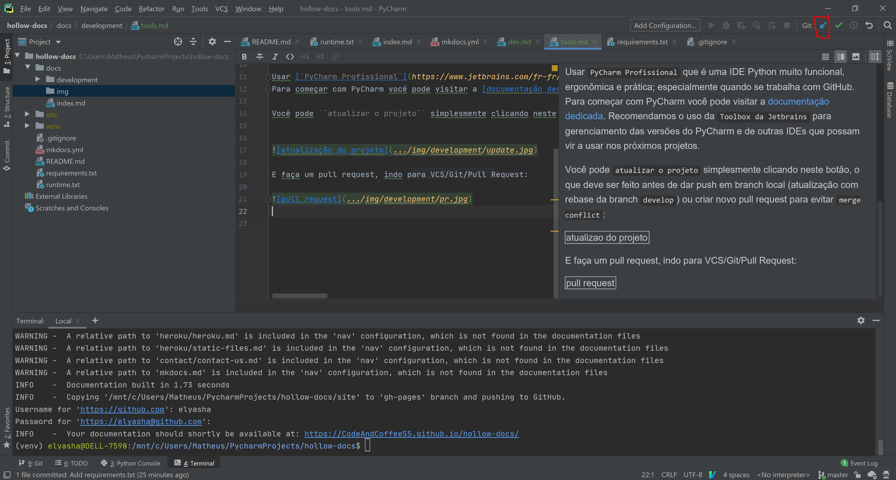
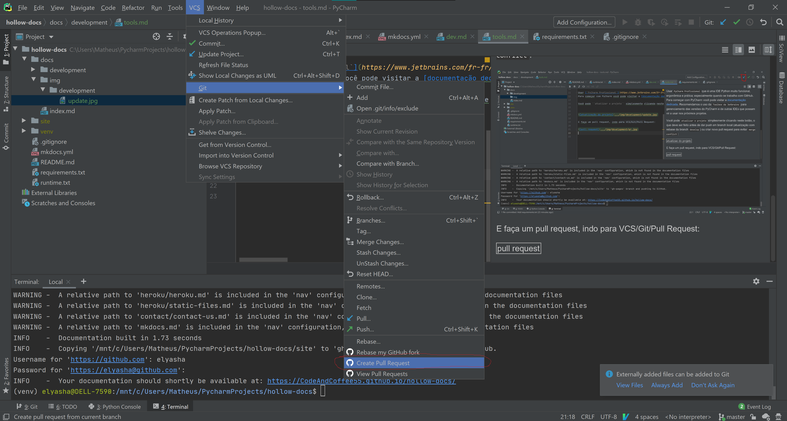

# Ferramentas de dev para o projeto Hollow

## Merge de todo o trabalho dos desenvolvedores

O merge de todo o código é feito no [`GitHub`](https://github.com/CodeAndCoffee55/hollow-website) nos projetos chamados ``hollow-website`` e ``hollow-docs``.
GitHub é uma ferramenta muito útil para compartilhar o trabalho de diferentes desenvolvedores.
Para começar a trabalhar com GitHub e entender como funciona, consulte os vários [Guias GitHub](https://guides.github.com/) disponíveis online, veja vídeos sobre ``gitflow workflow``, o qual será usado aqui e consulte as [cheatsheets disponíveis](https://devhints.io/) (basta pesquisar por ``git``).

E finalmente, e talvez o mais importante é mencionar que usamos o GitFlow WorkFlow. 
Isso quer dizer que, sempre iremos ter as seguintes branchs ativas :

1. `master`: usada somente para tags e deploys

2. ``production``: usada para staging e testes de deploys

2. `develop`: usada para desenvolvimento global (com a modificação de todos os devs)

3. `dev/{user}/feature-to-be-created`: usada para criar uma nova feature ou função ao repositório.
Atenção: em `user`, colocar seu nome de usuário (`username`) do GitHub.

4. `hotfix`: Branch para lidar com um bug ou algo que não funciona como previsto na release.

5. ```release/{version}```: Branch para release na qual não será adicionado mais funcionalidades, somente correção de bugs entre outros. (com a versão que será proposta)


Para mais informações, por favor, olhar esses arquivos externos:

- [Como funciona o workflow](https://www.atlassian.com/git/tutorials/comparing-workflows/gitflow-workflow)

- [Video - Git Flow](https://www.youtube.com/watch?v=oweffeS8TRc)

## IDE padrão para desenvolver em localhost

Usar [`PyCharm Profissional`](https://www.jetbrains.com/fr-fr/pycharm/download/#section=windows) que é uma IDE Python muito funcional, ergonômica e prática; especialmente quando se trabalha com GitHub.
Para começar com PyCharm você pode visitar a [documentação dedicada](https://www.jetbrains.com/pycharm). Recomendamos o uso da [``Toolbox da Jetbrains``](https://www.jetbrains.com/toolbox-app/) para gerenciamento das versões do PyCharm e de outras IDEs que possam vir a usar nos próximos projetos.

Você pode ``atualizar o projeto`` simplesmente clicando neste botão, o que deve ser feito antes de dar push em branch local (atualização com rebase da branch ``develop``) ou criar novo pull request para evitar ``merge conflict``:




E faça um pull request, indo para VCS/Git/Pull Request:



